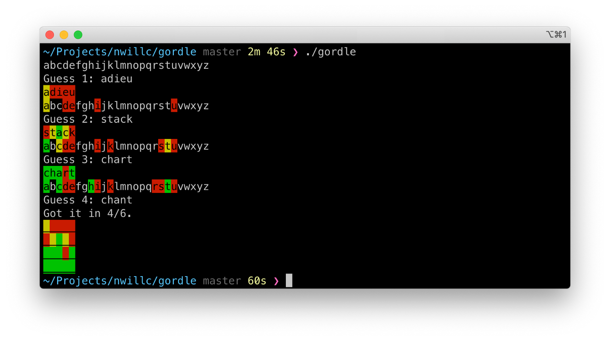

# Gordle

A Go language version of Wordle.

## Running

```shell
$ go build gordle.go
$ ./gorgle
```



## Notes

 - I use Red/Amber/Green rather than Gray/Gold/Green.
 - I'm still not happy with the word list I created [dict.txt](./data/dict.txt). Some proper names,
some place names. Looking at past Wordle words though don't completely like their curation either.

